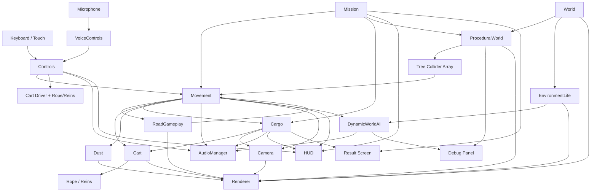
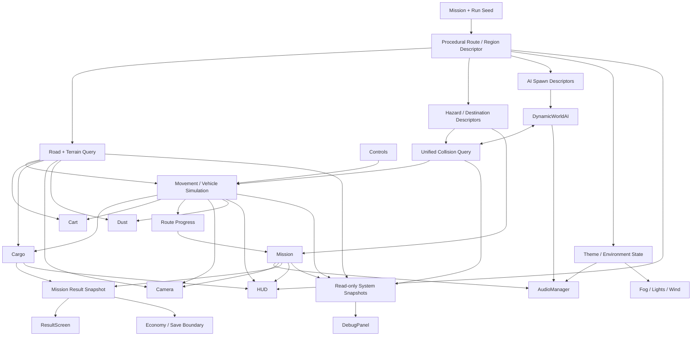

# Bailgadi Gameplay Integration Audit

## Scope and scoring

This report audits the current working tree as it exists now. It includes the procedural-world code in `src/procedural-world.js` and its integrations in `src/world.js`, `src/main.js`, and `index.html`.

“Connected” means there is a real runtime data or call path. It does not imply the connection is well abstracted. Most connections are coordinated directly by `src/main.js`; the systems rarely import one another.

Implementation estimates are relative planning estimates, not commitments:

- **Small:** approximately 1–2 files and under 100 lines.
- **Medium:** approximately 2–5 files and 100–350 lines.
- **Large:** approximately 5–10 files and 350–900 lines.
- **XL:** cross-cutting redesign, usually more than 10 files or 900 lines.

Gap IDs identify unique integration work packages. A gap can appear under multiple systems because the missing connection is reciprocal. The final ranking includes every unique gap exactly once.

---

## 1. Controls

### Current ownership

`Controls` owns input enablement, latched forward speed levels, reverse state, held left/right steering, keyboard and pointer listeners, button active CSS, target-speed lookup, mode labels, and the drive-change callback.

### Currently connected

- ✓ **Movement:** `updateMovement()` polls target speed and steering every started frame.
- ✓ **Cart / Rope-Reins:** successful drive changes trigger driver and rein reactions.
- ✓ **AudioManager:** keyboard/touch drive changes request driver calls.
- ✓ **VoiceControls:** voice commands call the same public speed methods.
- ✓ **HUD / Debug Panel:** mode, level, target speed, and combined state are displayed.
- ✓ **Mission lifecycle:** main enables/disables/resets controls at start, finish, failure, and replay.

### Missing integrations

| Gap | Missing integration | Current limitation | Ideal integration | Difficulty | Estimated size | Potential risks |
|---|---|---|---|---|---|---|
| G01 | Action abstraction and remapping | Keyboard, touch, and voice encode drive semantics through device-specific branches. Brake means full stop; “decrease” is not a decrement. | Define semantic actions (`increasePace`, `decreasePace`, `stop`, `reverse`, `steer`) before device bindings; let UI/settings supply mappings. | Medium | 3–4 files, 150–280 lines | Changes to latched behavior could alter game feel and voice tests. |
| G02 | Settings/save integration | Control bindings, touch behavior, and input preferences are not persisted or configurable. | Read a versioned input settings model at construction and publish changes to a save/settings boundary. | Medium | 3–5 files, 150–300 lines | Browser key conflicts, migration/default issues, accessibility regressions. |
| G03 | UI focus/pause gating | Global game keys are prevented whenever Controls is enabled, regardless of focused UI; there is no pause state. | Route screen state/focus into Controls so gameplay input is suspended for menus, dialogs, or pause. | Small | 2–3 files, 50–100 lines | Stuck steering or unintended retained speed when focus changes. |

---

## 2. Movement

### Current ownership

Movement is not a module; it is state and functions in `main.js`. It owns target-to-actual speed interpolation, acceleration/braking, heading, steering, cart root position/rotation, fixed world clamps, travelled distance, scenery collision response, fixed hazard response, and the call order for progress, cargo, cart animation, dust, and audio.

### Currently connected

- ✓ **Controls:** reads target speed and held steering.
- ✓ **Mission:** gates movement by journey status and updates progress.
- ✓ **ProceduralWorld:** sends cart position/difficulty to streaming and scans its collider records.
- ✓ **RoadGameplay:** checks hazard impacts and samples roughness/roll.
- ✓ **Cargo:** supplies acceleration, turn, roughness, impact, and suspension.
- ✓ **Cart / Rope-Reins:** supplies speed/travel/surface/acceleration.
- ✓ **Dust and AudioManager:** supplies continuous movement state.
- ✓ **Camera, HUD, Debug Panel, DynamicWorldAI:** publishes position/speed/heading through shared state.

### Missing integrations

| Gap | Missing integration | Current limitation | Ideal integration | Difficulty | Estimated size | Potential risks |
|---|---|---|---|---|---|---|
| G04 | Procedural road/terrain query | Cart moves on a flat, straight global X/Z plane while the visible road curves, narrows, rises, and falls. | Movement should query one road contract for center, width, height, tangent, slope, and surface at the cart position. | High | 5–8 files, 450–800 lines | Vehicle feel, checkpoint math, camera, hazards, collisions, and mission completion can all regress. |
| G05 | Dynamic actor collision/avoidance feedback | AI actors avoid the cart visually, but movement cannot collide with or respond to them. | A unified collision query should return actor contacts; movement should apply safe slowdown/impact rules and notify AI. | High | 4–7 files, 300–650 lines | Unfair invisible hits, tunneling, actor trapping, performance spikes. |
| G06 | Vehicle capability data | Maximum speed, acceleration, braking, and steering are hard-coded and cannot be modified by cargo, bull condition, upgrades, or mission rules. | Movement should consume a resolved vehicle specification each frame/run. | Medium | 3–5 files, 180–350 lines | Cross-system balancing changes and save compatibility. |
| G07 | Off-road/slope gameplay | There is no road-boundary, traction, slope, or terrain penalty despite generated widths/elevation. | Road query should feed traction, speed/steering limits, cargo stress, dust, and feedback. | High | 5–7 files, 350–700 lines | Poor handling on seams; duplicated penalties across movement and cargo. |

---

## 3. Camera

### Current ownership

Camera logic in `main.js` owns responsive FOV/chase tuning, chase interpolation, speed pullback, steering offset, suspension/cargo/collision shake, look target, measured camera distance, and repositioning the sun around the cart.

### Currently connected

- ✓ **Movement / Cart:** follows cart pose, heading, speed, and suspension.
- ✓ **Cargo:** stability produces camera feedback/shake.
- ✓ **RoadGameplay:** sampled roughness affects surface shake indirectly.
- ✓ **World:** repositions the directional sun and its target.
- ✓ **HUD/Debug:** publishes camera distance/position in diagnostics.

### Missing integrations

| Gap | Missing integration | Current limitation | Ideal integration | Difficulty | Estimated size | Potential risks |
|---|---|---|---|---|---|---|
| G08 | Procedural terrain/road tangent | Camera looks along vehicle heading without knowledge of generated slope, road tangent, nearby occluders, or road edges. | Consume the unified road/terrain query and collision-safe chase points. | Medium | 3–5 files, 180–320 lines | Jitter at chunk seams, sudden camera corrections, motion sickness. |
| G09 | Mission/result camera states | Start, checkpoint, cargo failure, and arrival use the same chase camera behind overlays. | Mission lifecycle should select explicit camera modes/transitions without owning camera transforms directly. | Medium | 3–4 files, 180–300 lines | Cutscene/control timing mismatch and abrupt transitions. |
| G10 | User camera settings | No sensitivity, shake reduction, FOV preference, or accessibility setting exists. | Read camera settings and independently scale steering offset, shake layers, distance, and FOV. | Small | 2–3 files, 70–140 lines | Altered framing on mobile and UI overlap. |

---

## 4. Mission

### Current ownership

Mission logic in `main.js` owns five definitions, current/next indices, cargo/reward/distance/time/roughness/level data, start Z, progress, four checkpoints, journey state, success deceleration, cargo-loss failure, and next-mission selection.

### Currently connected

- ✓ **Movement and Controls:** mission status gates target speed and control enablement.
- ✓ **Cargo:** mission selects cargo type/difficulty; cargo loss fails the mission.
- ✓ **ProceduralWorld:** mission level is passed as generation difficulty.
- ✓ **RoadGameplay:** hazards reset on replay; fixed destination shares the hard-coded end Z.
- ✓ **Cart/Dust:** replay resets their visual state.
- ✓ **HUD and Result Screen:** mission data, progress, timer, reward, and outcome are rendered.
- ✓ **AudioManager:** cargo failure requests a failure cue.

### Missing integrations

| Gap | Missing integration | Current limitation | Ideal integration | Difficulty | Estimated size | Potential risks |
|---|---|---|---|---|---|---|
| G11 | Enforced timer policy | The countdown reaches `00:00` but never fails or changes rewards. | Mission definition should declare timer behavior and emit timeout/result consistently. | Small | 2–3 files, 60–120 lines | Existing missions may become unexpectedly difficult; finish/timeout race. |
| G12 | Reward/economy/persistence | Rewards are display-only; failure also advances to the next mission. | Mission result should emit awarded reward, unlocks, retry/advance policy, and save transaction. | High | 5–9 files, 400–800 lines | Duplicate awards, save corruption, progression dead ends. |
| G13 | Procedural destination/route | Every mission ends at global Z 480 regardless of generated villages, landmarks, curves, or seed. | Mission should select a deterministic destination region/chunk and measure progress along the generated route. | High | 5–8 files, 400–750 lines | Unreachable destinations, non-monotonic progress, seed/replay inconsistency. |
| G14 | Mission-specific RoadGameplay | All missions use the same 14 hazards; mission difficulty only changes procedural layout and cargo roughness multiplier. | Mission data should select deterministic hazard density/types/checkpoints and pass a route descriptor to RoadGameplay. | Medium | 3–5 files, 220–400 lines | Hazard fairness and mismatch with procedural road. |
| G15 | Mission audio/camera feedback | Success and checkpoints have no dedicated audio; result camera remains normal chase. | Mission events should be consumed by AudioManager and camera modes. | Medium | 3–5 files, 150–300 lines | Duplicate cue playback and lifecycle ordering errors. |
| G16 | Checkpoint consequences | Checkpoints only show a timed message. | Mission definitions should allow checkpoint rewards, time bonuses, save markers, dialogue, or difficulty transitions. | Medium | 3–6 files, 180–380 lines | Re-triggering after reverse movement and inconsistent persistence. |

---

## 5. Cargo

### Current ownership

Cargo owns type tuning, selected cargo visibility, stability/damage/status, continuous damage and recovery, impact damage, spring offsets/velocities, cargo transform, and driver worry/look/lean/rein feedback.

### Currently connected

- ✓ **Mission:** type/difficulty on reset; zero stability causes mission failure.
- ✓ **Movement / RoadGameplay:** consumes acceleration, speed ratio, steering, sampled roughness, impacts, and suspension.
- ✓ **Cart / Rope-Reins:** mutates cargo root and shared driver fields; rope tension informs cargo audio.
- ✓ **Camera:** low stability increases camera feedback.
- ✓ **AudioManager:** instability/type/tension select cargo cues and failure sound.
- ✓ **HUD/Debug/Result:** live stability is displayed; failure outcome is shown.

### Missing integrations

| Gap | Missing integration | Current limitation | Ideal integration | Difficulty | Estimated size | Potential risks |
|---|---|---|---|---|---|---|
| G17 | Procedural terrain surface | Cargo stress uses only fixed hazard roughness plus mission multiplier, not generated uneven/uphill/downhill road. | Unified surface query should feed slope, unevenness, road material, and off-road state. | Medium | 3–5 files, 180–350 lines | Double-counting roughness and destabilizing balance. |
| G18 | Scenery/actor collision severity | Procedural scenery collision uses a generic `cargoImpact=0.4`; dynamic actors never affect cargo. | Collision results should carry material/type/relative speed/severity into cargo. | Medium | 3–5 files, 160–320 lines | Excessive damage from low-speed contacts and inconsistent severity scales. |
| G19 | Delivery quality/reward grading | Remaining stability has no effect on reward or result details unless it reaches zero. | Mission result should consume cargo condition and calculate a transparent quality/reward grade. | Medium | 3–5 files, 160–300 lines | Player confusion, reward exploits, tuning complexity. |
| G20 | Rope/load constraint feedback | Rope tension is visual/audio telemetry only and does not affect cargo stability or movement. | Define a stable constraint/load signal consumed by cargo and possibly vehicle traction, without using raw animation fields as physics. | High | 4–7 files, 300–600 lines | Circular dependencies between animation and simulation. |

---

## 6. RoadGameplay

### Current ownership

`road-gameplay.js` owns fourteen fixed hazard meshes/descriptors, hit flags, footprint impact detection, local surface roughness/roll sampling, replay reset, and a fixed destination landmark at Z 480.

### Currently connected

- ✓ **Movement:** impact query and surface sampling.
- ✓ **Cargo, Cart, Camera, Dust/Audio:** movement forwards RoadGameplay effects.
- ✓ **Mission:** hazards reset on replay; finish coordinate matches destination Z.
- ✓ **World scene:** its group is rendered in the same scene.

### Missing integrations

| Gap | Missing integration | Current limitation | Ideal integration | Difficulty | Estimated size | Potential risks |
|---|---|---|---|---|---|---|
| G21 | Procedural road placement | Hazards remain at fixed X/Z and can appear beside or outside a curved/narrow generated road. | Generate/place hazards from route samples and chunk seed; activate/recycle them with chunks. | High | 4–7 files, 320–650 lines | Seams, repeated hits after recycling, unfair placement. |
| G22 | Procedural destination ownership | Fixed destination can overlap arbitrary chunk content and is unrelated to generated villages. | Destination should be a mission-selected procedural region/landmark with one authoritative trigger volume. | High | 4–7 files, 300–600 lines | Missing/duplicate marker, route completion errors. |
| G23 | Unified collider registry | Fixed hazards and procedural tree colliders use separate scans and response rules. | Register hazards/scenery/actors with a spatial query service and typed contact results. | High | 5–8 files, 450–850 lines | Regression in hit detection, IDs, reset semantics, performance. |
| G24 | AI awareness of hazards | NPCs/animals can walk through logs, potholes, rocks, destination props, and procedural scenery. | AI movement should query road hazards/colliders or receive safe navigation lanes. | High | 4–7 files, 300–650 lines | Actor deadlocks and expensive path checks. |

---

## 7. ProceduralWorld

### Current ownership

`WorldGenerator` and its sub-generators own the random session seed, nine pooled 80 m chunk scene graphs, seven-chunk active range, road/ground geometry, ten themes, instanced scenery, villages, landmarks, visual event crowds, count-based LOD, 90 tree-collider records, reseeding, and debug metadata.

### Currently connected

- ✓ **World:** created and returned by `createWorld()`.
- ✓ **Movement:** receives cart position and supplies collider records.
- ✓ **Mission:** receives mission level as generation difficulty.
- ✓ **Renderer:** adds pooled groups to the scene and receives previous-frame draw calls for debug.
- ✓ **Debug Panel:** publishes chunk, layout, theme, village, landmark, count, LOD, draw calls, and FPS.
- ✓ **EnvironmentLife:** its initial RNG is derived from the world seed once.

### Missing integrations

| Gap | Missing integration | Current limitation | Ideal integration | Difficulty | Estimated size | Potential risks |
|---|---|---|---|---|---|---|
| G04 | Movement/vehicle terrain | Generated centerline, width, and height are presentation-only. `sampleRoadCenter()` is unused. | Expose a complete route/terrain query consumed by movement, cart, cargo, camera, and dust. | High | 5–8 files, 450–800 lines | Core handling and mission regressions. |
| G21 | RoadGameplay | Fixed hazards do not stream, align, or seed with chunks. | Chunk descriptors should own deterministic hazard spawn records used by RoadGameplay. | High | 4–7 files, 320–650 lines | Recycled-hit identity and placement fairness. |
| G13 | Mission/destination | Generator creates villages/landmarks, but missions cannot select or persist them. | Expose deterministic regions and route distance; mission selects destination by descriptor. | High | 5–8 files, 400–750 lines | Reproducibility and unreachable goals. |
| G25 | DynamicWorldAI chunk spawning | Procedural event people are static cylinders; the fixed AI cast does not stream with chunks. | Chunks should publish actor spawn descriptors and activation/release events to AI pools. | XL | 7–12 files, 700–1,300 lines | Actor identity, state persistence, pooling bugs, CPU growth. |
| G26 | EnvironmentLife reseeding | Replay usually reseeds terrain after a backward teleport, but fixed villagers/animals retain the old seed and positions. | Reseed should be explicit and coordinated, or mission replay should retain a stable seed; actor content must share the decision. | Medium | 3–5 files, 150–320 lines | Visible popping and broken reproducibility. |
| G27 | Audio/environment theme | Themes, villages, water, landmarks, and procedural events do not influence ambience. | Publish current-region descriptors to audio/environment consumers with transition hysteresis. | Medium | 3–5 files, 180–350 lines | Rapid ambience switching near chunk boundaries. |
| G28 | Camera/frustum-based streaming | Active range is based only on cart chunk, not camera direction/fog/visibility. | Streaming/LOD policy should consider camera/fog while preserving gameplay chunks around the cart. | Medium | 2–4 files, 120–260 lines | Missing scenery during camera transitions or excess memory. |

---

## 8. World

### Current ownership

`world.js` is the composition facade for scene background, fog, procedural world, fixed EnvironmentLife, the directional sun, hemisphere light, and the collider array returned to main.

### Currently connected

- ✓ **ProceduralWorld and EnvironmentLife:** creates both layers with related initial seeds.
- ✓ **Camera/Movement:** main moves the sun with the cart and consumes world colliders.
- ✓ **Renderer:** all world content and lights share the scene.
- ✓ **DynamicWorldAI/AudioManager:** main injects audio into the world-life facade.

### Missing integrations

| Gap | Missing integration | Current limitation | Ideal integration | Difficulty | Estimated size | Potential risks |
|---|---|---|---|---|---|---|
| G29 | Unified environment state | Fog, background, lighting, procedural theme, ambience, and wind have no shared state or transition model. | World should return an environment interface describing region, weather/time inputs, lighting/fog targets, and audio ambience. | High | 5–8 files, 350–700 lines | Visual/audio discontinuities and unclear ownership of the sun. |
| G23 | Unified world queries | World returns a loose obstacle array rather than terrain/collision/region queries. | Return stable read-only query interfaces and lifecycle events, not generator internals. | High | 4–7 files, 300–600 lines | Broad caller migration and accidental behavior changes. |
| G30 | Lifecycle/disposal | World layers cannot reset/dispose together; reseeding affects only procedural content. | Define coordinated `reset/reseed/update/dispose` behavior across terrain, actors, effects, and lights. | High | 5–9 files, 350–750 lines | Resource leaks or destruction of shared geometries/materials. |

---

## 9. DynamicWorldAI

### Current ownership

`DynamicWorldAI` owns SpawnManager, NPCManager, AnimalManager, AmbientEventManager, update timing, and aggregate diagnostics. Subsystems own actor activation, state/waypoint/avoidance animation, spatial cue requests, ambient events, smoke, and wind.

### Currently connected

- ✓ **EnvironmentLife:** receives the fixed actor objects it constructs.
- ✓ **Movement:** receives cart position/speed every frame for visibility and avoidance.
- ✓ **AudioManager:** ambient manager requests procedural spatial cues.
- ✓ **World scene:** owns ambient effect groups and actor transforms.
- ✓ **Debug Panel:** publishes active counts, pool usage, event, and timing.

### Missing integrations

| Gap | Missing integration | Current limitation | Ideal integration | Difficulty | Estimated size | Potential risks |
|---|---|---|---|---|---|---|
| G25 | Procedural chunk lifecycle | AI positions are fixed at startup and do not match streamed villages, landmarks, or events. | Consume deterministic chunk spawn descriptors and retain/release pooled actors. | XL | 7–12 files, 700–1,300 lines | Actor duplication, lost state, performance, popping. |
| G24 | Road/collider navigation | Actors use hard-coded straight-road edges and direct waypoints; they ignore curved road and all geometry. | Query route lanes, road edges, and colliders or use a lightweight navigation graph per chunk. | High | 5–8 files, 450–900 lines | Pathing loops, actors blocking road, high CPU cost. |
| G05 | Bidirectional collision response | AI avoids the cart, but no contact result reaches movement or mission/cargo. | Shared contact/near-miss events should inform both vehicle response and actor behavior. | High | 4–7 files, 300–650 lines | Unfair penalties and collision instability. |
| G31 | Mission/event relevance | AI events never affect objectives, checkpoints, delivery conditions, or rewards. | Mission should opt into semantic AI/world events through explicit events, not actor internals. | Medium | 3–6 files, 220–450 lines | Random events making missions unwinnable or nondeterministic. |
| G32 | Procedural event unification | ProceduralWorld has six static “world events”; DynamicWorldAI separately has nine animated/audio events. | One descriptor/event pipeline should choose location, visuals, actors, audio, duration, and gameplay relevance. | High | 5–9 files, 450–850 lines | Double events, pool contention, seed/timing mismatch. |

---

## 10. EnvironmentLife

### Current ownership

`environment-life.js` constructs meshes and implicit actor schemas for villagers, large animals, chickens, bicycles, and shader smoke. It places a fixed cast, adds it to the scene, creates DynamicWorldAI, and exposes update/debug/manager/count references.

### Currently connected

- ✓ **World:** created with the scene and a seed-derived RNG.
- ✓ **DynamicWorldAI:** hands off actor objects, smoke sources, RNG, and wind targets.
- ✓ **AudioManager:** facade forwards injected audio manager.
- ✓ **Debug Panel:** exposes fixed counts and live AI diagnostics.

### Missing integrations

| Gap | Missing integration | Current limitation | Ideal integration | Difficulty | Estimated size | Potential risks |
|---|---|---|---|---|---|---|
| G25 | Chunk spawn ownership | All actor meshes are allocated and placed once; streamed villages have no population. | Separate reusable actor factories/pools from placement, and let chunk descriptors request actors. | XL | 7–12 files, 700–1,300 lines | Actor schema breakage and large memory/CPU changes. |
| G26 | Coordinated seed/replay | Initial placement uses the first world seed only. | Accept explicit run seed/lifecycle and rebuild or recycle actors consistently when intended. | Medium | 3–5 files, 150–320 lines | Pop-in and state loss during replay. |
| G29 | Theme-aware content | Clothing, actor mix, smoke, bicycles, and population do not respond to current theme/village. | Factories should consume region descriptors while preserving pooled schemas expected by AI. | High | 4–8 files, 350–700 lines | Content combinations missing required mesh parts. |

---

## 11. Dust

### Current ownership

`DustSystem` owns a 48/72-particle point pool, hoof/wheel anchor selection, travel-distance spawn accumulation, particle velocity/lifetime/fade, typed buffers, and replay reset.

### Currently connected

- ✓ **Movement:** receives cart, speed, travelled distance, and delta.
- ✓ **Cart:** transforms fixed local hoof/wheel anchor coordinates through the cart root.
- ✓ **Renderer:** owns one `THREE.Points` object in the scene.
- ✓ **Debug Panel:** active count is included in development state.
- ✓ **Mission:** reset on replay.

### Missing integrations

| Gap | Missing integration | Current limitation | Ideal integration | Difficulty | Estimated size | Potential risks |
|---|---|---|---|---|---|---|
| G33 | Surface/material/off-road state | Dust emission ignores road theme, moisture, crops, off-road travel, and generated terrain. | Consume normalized surface descriptors from the world query to change rate, color, lifetime, and drift. | Medium | 3–4 files, 120–260 lines | Excess particles and per-frame material churn. |
| G34 | Impact/skid events | Bumps, hard braking, sharp turns, and collisions do not inject distinct dust bursts. | Consume semantic vehicle events with bounded burst budgets. | Small | 2–3 files, 60–130 lines | Particle saturation and duplicate bursts. |
| G35 | Environment wind | Dust velocity is unrelated to ambient wind/events. | Read one environment wind vector shared with smoke/leaves. | Small | 2–4 files, 70–150 lines | Inconsistent coordinate spaces and unnatural drift. |

---

## 12. AudioManager

### Current ownership

AudioManager owns the Web Audio context/master gain, mute persistence/button, seven MP3 buffers, four loops, five synthesized cargo buffers, driver/bump/cargo one-shots, synthesized world cues, concurrency/cooldown state, movement mixing, and audio diagnostics.

### Currently connected

- ✓ **Controls:** manual drive changes play driver commands.
- ✓ **Movement / Cart / RoadGameplay:** speed, steering, gait, roughness, and impacts drive loops/bumps.
- ✓ **Cargo / Rope-Reins:** stability, cargo type, rope tension, and failure drive cues.
- ✓ **DynamicWorldAI:** receives spatial ambient cue requests.
- ✓ **HUD/Debug:** sound button and debug snapshot.
- ✓ **Mission:** Play unlocks audio; cargo failure plays a cue.

### Missing integrations

| Gap | Missing integration | Current limitation | Ideal integration | Difficulty | Estimated size | Potential risks |
|---|---|---|---|---|---|---|
| G15 | Mission/checkpoint/result cues | No success, checkpoint, timeout, mission-start, or reward audio exists. | Consume semantic mission events with cue concurrency/priority rules. | Medium | 3–5 files, 150–300 lines | Cue overlap and double playback during state transitions. |
| G27 | Procedural region ambience | One village loop plays everywhere; themes/water/villages/landmarks do not affect ambience. | Crossfade region/theme ambience using hysteresis and an environment descriptor. | Medium | 3–5 files, 180–350 lines | Asset size, abrupt switching, loop phase issues. |
| G36 | Camera-oriented spatial audio | World cues pan by global X difference, ignoring camera/listener orientation and elevation. | Own a listener transform or use Three.js/Web Audio spatial nodes updated from camera. | Medium | 3–5 files, 180–360 lines | Browser performance and inconsistent perceived location. |
| G37 | Voice-origin driver feedback | Voice-model commands intentionally skip `chal`/`ruk`, making driver audio inconsistent with manual commands. | Define an explicit policy: recognized command can request response audio without feeding the recognizer or causing loops. | Small | 2–3 files, 40–100 lines | Feedback audio may retrigger the microphone model. |
| G38 | Audio buses/settings | Only global mute exists; voice, vehicle, ambience, cargo, and UI cannot be balanced separately. | Add named buses and persisted volume/accessibility settings. | Medium | 3–5 files, 180–350 lines | Gain staging, clipping, migration, mobile resource limits. |

---

## 13. VoiceControls

### Current ownership

VoiceControls owns browser support detection, lazy model loading, recognizer/microphone lifecycle, score validation, mic-level interval, prediction UI, CommandTriggerGate, START/STOP mapping, cooldowns, and voice diagnostics.

### Currently connected

- ✓ **Controls:** calls shared increase/decrease methods.
- ✓ **Cart/Rope-Reins:** Controls callback triggers reactions labelled as voice.
- ✓ **HUD/Debug Panel:** owns voice button/message/diagnostics.
- ✓ **Mission lifecycle indirectly:** disabled Controls reject commands outside play.
- ✓ **Development tests:** query-parameter paths call model/command methods.

### Missing integrations

| Gap | Missing integration | Current limitation | Ideal integration | Difficulty | Estimated size | Potential risks |
|---|---|---|---|---|---|---|
| G39 | Explicit mission/screen lifecycle | Recognizer can continue listening on result/start states even though Controls rejects changes. | Screen/journey state should suspend or clearly gate recognition and restore it by policy. | Medium | 3–4 files, 120–240 lines | Permission churn, lost microphone state, confusing UI. |
| G37 | Audio feedback policy | Voice commands skip driver audio, but no echo-safe alternative feedback is defined. | Coordinate AudioManager and recognizer suppression/ducking for voice feedback. | Medium | 3–4 files, 100–220 lines | Self-triggering and missed predictions. |
| G01 | Semantic command layer | START always increments one speed level and STOP fully stops because it mirrors Controls internals. | Map model labels to semantic actions configured independently of physical bindings. | Medium | 3–4 files, 150–280 lines | Breaking trained-label expectations and tests. |
| G40 | Voice settings/model diagnostics | Thresholds/model URL/language are compile-time constants; errors are visible only in the same compact HUD area. | Provide persisted sensitivity/language settings and a dedicated diagnostics/settings surface. | Medium | 3–6 files, 180–380 lines | Poor thresholds can create unsafe false triggers. |

---

## 14. Cart

### Current ownership

`cart.js` owns construction of the cart root, bulls, legs, wheels, driver, cargo meshes, harness, anchors, contact shadows, shared `animationParts`, and procedural gait/suspension/driver animation.

### Currently connected

- ✓ **Movement:** main moves/rotates root and supplies continuous animation inputs.
- ✓ **Cargo:** cargo manager receives roots/groups/parts and writes driver fields.
- ✓ **Rope/Reins:** construction and animation delegate to rope system.
- ✓ **RoadGameplay:** hazard impacts inject cart suspension.
- ✓ **Controls / VoiceControls:** drive changes trigger driver reactions.
- ✓ **AudioManager:** gait playback rate and rope tension influence audio.
- ✓ **Camera/HUD/Debug:** suspension and transforms are consumed.

### Missing integrations

| Gap | Missing integration | Current limitation | Ideal integration | Difficulty | Estimated size | Potential risks |
|---|---|---|---|---|---|---|
| G04 | Procedural terrain pose | Root Y is fixed; wheels/bulls do not conform to road height/slope/camber. | Consume terrain samples at wheels/hooves and separate simulation pose from suspension animation. | High | 5–8 files, 450–800 lines | Foot sliding, mesh penetration, camera jitter. |
| G06 | Vehicle specification/upgrades | Geometry and animation use fixed speed assumptions; no resolved bull/cart stats exist. | Construction consumes visual spec; animation consumes normalized simulation state rather than imported max-speed constant. | High | 4–7 files, 300–600 lines | Visual/stat mismatch and reset compatibility. |
| G05 | Actor/scenery contact animation | Only fixed road hazards trigger a cart bump; procedural tree collisions and actors do not. | Typed collision events should inject material/side/severity-specific reactions. | Medium | 3–5 files, 160–320 lines | Duplicate impact impulses and exaggerated shaking. |
| G41 | Animation/simulation boundary | `animationParts` mixes mesh references, telemetry, and quasi-physics fields shared across modules. | Publish a narrow vehicle visual input and read-only telemetry contract. | High | 5–8 files, 400–750 lines | Large migration and subtle animation-order regressions. |

---

## 15. Rope/Reins

### Current ownership

The rope/rein system owns four Catmull-Rom curves, 44 cylinder segment meshes, anchor conversion, sag/sway/vibration, damped rope/rein tension, command input target/hold/source, driver arm adjustments, and debug labels.

### Currently connected

- ✓ **Cart:** owns anchors, calls update/reset, and shares driver arms.
- ✓ **Controls/VoiceControls:** drive reactions trigger manual/voice input animations.
- ✓ **Movement:** speed, acceleration, and suspension drive tension.
- ✓ **Cargo/AudioManager:** rope tension selects some cargo audio; cargo braking adds arm pull.
- ✓ **Debug Panel:** tensions and command state are displayed.

### Missing integrations

| Gap | Missing integration | Current limitation | Ideal integration | Difficulty | Estimated size | Potential risks |
|---|---|---|---|---|---|---|
| G20 | Simulation/load contract | Tension is derived from animation inputs and then exposed as if it were gameplay state. | Vehicle/cargo simulation should produce load; rope visuals consume it. If rope condition affects gameplay, publish a separate domain value. | High | 4–7 files, 300–600 lines | Circular feedback and unstable tuning. |
| G42 | Damage/condition feedback | Ropes cannot loosen, wear, break, or reflect cargo/bull equipment state. | A future equipment/condition model should drive visual material/sag and semantic failure events. | High | 4–7 files, 300–600 lines | New failure mode can feel random; visual segment cost. |
| G41 | Transform ownership | Rope update overwrites driver arm rotations, then cart adds cargo rein pull afterward. | Compose named animation layers in a deterministic pose pipeline. | Medium | 3–5 files, 200–400 lines | Changed hand alignment and curve-anchor jitter. |

---

## 16. HUD

### Current ownership

The HUD DOM/CSS and `main.updateHud()` own distance, remaining distance, absolute speed, speed mode, mission name/reward/timer, cargo stability/status, journey progress, voice/audio controls, and the hidden accessible objective.

### Currently connected

- ✓ **Movement/Controls:** speed, distance, progress, mode.
- ✓ **Mission:** name, reward, timer, remaining distance.
- ✓ **Cargo:** stability value, meter, and status styling.
- ✓ **VoiceControls/AudioManager:** interactive buttons and status.
- ✓ **Result/Checkpoint:** separate overlays share the same page state.

### Missing integrations

| Gap | Missing integration | Current limitation | Ideal integration | Difficulty | Estimated size | Potential risks |
|---|---|---|---|---|---|---|
| G43 | Procedural navigation/context | HUD cannot show road direction, current village/theme, destination identity, or route-aligned progress. | Consume mission/world view data: destination, route distance, next turn/region, and optional landmark. | Medium | 3–6 files, 200–400 lines | UI clutter and misleading route guidance. |
| G12 | Real reward/progression state | “Coins” are static mission metadata; no balance, earned amount, or unlock state is shown. | Render economy/result view models after transactional reward calculation. | High | 5–9 files, 400–800 lines | Displaying stale or uncommitted rewards. |
| G11 | Timer consequence state | Timer silently stops at zero without warning or failure policy. | HUD should reflect mission timer policy, urgency thresholds, and timeout result. | Small | 2–3 files, 60–130 lines | Accessibility/color-only warnings. |
| G44 | Event-driven warnings | Most text is rewritten every frame; collision, off-road, cargo thresholds, and input rejection lack unified notices. | Consume semantic notification events with priority and accessibility announcements. | Medium | 3–5 files, 180–350 lines | Message spam and announcements overlapping. |
| G45 | Pause/settings/mission selection | There is no screen controller for pause, settings, briefing, or mission choice. | Add explicit screen state and keep HUD rendering separate from gameplay state. | High | 5–9 files, 400–800 lines | Input focus, mobile layout, and lifecycle complexity. |

---

## 17. Result Screen

### Current ownership

One overlay is reused for success and cargo failure. Main owns its eyebrow, title, copy, button label, visibility, focus, and the decision to advance to the next mission.

### Currently connected

- ✓ **Mission:** shown on success or cargo loss; uses cargo label and next index.
- ✓ **Controls/Movement:** controls disabled and vehicle stopped/finishing.
- ✓ **Cargo:** failure type and success cargo label.
- ✓ **Touch/HUD:** touch controls hidden; overlay sits over continuing render/update.
- ✓ **Replay:** button always launches the selected next mission.

### Missing integrations

| Gap | Missing integration | Current limitation | Ideal integration | Difficulty | Estimated size | Potential risks |
|---|---|---|---|---|---|---|
| G46 | Run metrics and cargo grade | Result has no time, distance, stability, collisions, voice use, checkpoints, or performance summary. | Mission result snapshot should be immutable and render a concise breakdown. | Medium | 3–5 files, 180–350 lines | Capturing metrics after state reset or mutation. |
| G12 | Reward/progression transaction | Result displays no earned coins/unlocks; failure skips to a new mission rather than offering policy-driven retry. | Show committed reward/unlocks and mission-defined retry/next choices. | High | 5–9 files, 400–800 lines | Duplicate claims, incorrect next mission, save failures. |
| G15 | Result audio/camera | No success cue, failure-specific camera, or arrival presentation exists. | Consume mission result event through audio and camera mode consumers. | Medium | 3–5 files, 150–300 lines | Overlay timing and repeated result calls. |
| G39 | Voice lifecycle | Microphone can remain active behind the result overlay. | Result screen state should suspend/disable voice by explicit policy and restore it safely. | Medium | 3–4 files, 120–240 lines | Permission/state churn and confusing voice UI. |

---

## 18. Debug Panel

### Current ownership

The HTML and `main.updateMovementDebug()` own voice, movement, cargo, DynamicWorldAI, and ProceduralWorld diagnostic fields. Updates are throttled to 100 ms. Development mode separately serializes a large per-frame game snapshot into `body.dataset.gameState`.

### Currently connected

- ✓ **Controls, Movement, Camera, Cart, Rope/Reins, Cargo:** live telemetry.
- ✓ **VoiceControls:** model, microphone, gate, and prediction diagnostics.
- ✓ **DynamicWorldAI:** actor counts, pool usage, event, timing.
- ✓ **ProceduralWorld:** chunk/theme/village/landmark/object/LOD/FPS/draw-call data.
- ✓ **Dust and AudioManager:** included in development dataset.

### Missing integrations

| Gap | Missing integration | Current limitation | Ideal integration | Difficulty | Estimated size | Potential risks |
|---|---|---|---|---|---|---|
| G47 | Visible debug toggle | `VOICE_DEBUG_ENABLED` is true, but CSS permanently sets the panel to `display:none`. | A development/settings toggle should control visibility and update cost explicitly. | Small | 2–3 files, 30–80 lines | Exposing internal diagnostics in production or blocking touch UI. |
| G48 | Integration diagnostics | No view shows road center/width/height versus cart, fixed-hazard alignment, active collider ownership, destination descriptor, or world seed. | Add read-only integration diagnostics and visual overlays behind a debug flag. | Medium | 3–6 files, 180–400 lines | Debug rendering affecting measured performance. |
| G49 | Accurate profiling telemetry | Draw calls are one frame old; only NPC update time is measured; development serialization itself allocates every frame. | Sample renderer stats after render, measure subsystem timings, and disable serialization unless requested. | Medium | 3–5 files, 150–300 lines | Observer overhead and misleading timing without warm-up. |
| G50 | Mission/audio/result diagnostics | Debug snapshot omits world seed, timer policy, reward transaction, result snapshot, and some ambient/procedural event details. | Publish structured read-only snapshots from each subsystem rather than reaching into mutable fields. | Medium | 4–7 files, 220–450 lines | Debug API becoming another tightly coupled public contract. |

---

## 19. Missing Integration Ranking

Player Impact estimates how strongly the completed integration would affect visible play, fairness, feedback, or progression. Development Cost uses the size categories defined at the top. “Recommended Order” is the practical sequence, so it may differ from raw player-impact rank when foundational work must precede a feature.

| Rank | Feature | Player Impact | Development Cost | Risk | Recommended Order |
|---:|---|---|---|---|---:|
| 1 | **G04 — Procedural road/terrain → Movement/Cart/Camera** | Very High | Large | High | 3 |
| 2 | **G13 — Procedural destinations and route-based missions** | Very High | Large | High | 6 |
| 3 | **G21 — Streamed hazards aligned to procedural road** | Very High | Large | High | 7 |
| 4 | **G12 — Reward, economy, progression, and persistence transaction** | Very High | Large | High | 15 |
| 5 | **G25 — Procedural chunk-driven AI spawning/pooling** | Very High | XL | High | 13 |
| 6 | **G23 — Unified collider/world-query registry** | High | Large | High | 2 |
| 7 | **G05 — Bidirectional vehicle/actor collision integration** | High | Large | High | 12 |
| 8 | **G07 — Off-road, traction, and slope gameplay** | High | Large | High | 8 |
| 9 | **G24 — AI navigation against generated road and hazards** | High | Large | High | 14 |
| 10 | **G11 — Enforced timer policy and HUD urgency** | High | Small | Medium | 10 |
| 11 | **G19 — Cargo quality affects delivery grade/reward** | High | Medium | Medium | 16 |
| 12 | **G14 — Mission-specific deterministic hazards/difficulty** | High | Medium | Medium | 9 |
| 13 | **G29 — Unified environment/theme/light/fog/audio state** | High | Large | Medium-High | 18 |
| 14 | **G06 — Vehicle capability specification for cargo/upgrades/stamina** | High | Medium | Medium | 11 |
| 15 | **G22 — Procedural destination visual ownership** | High | Large | High | 6 |
| 16 | **G32 — Unify procedural and DynamicWorldAI ambient events** | Medium-High | Large | High | 20 |
| 17 | **G15 — Mission/checkpoint/result audio and camera feedback** | Medium-High | Medium | Medium | 17 |
| 18 | **G46 — Immutable result metrics and run summary** | Medium-High | Medium | Low-Medium | 19 |
| 19 | **G43 — HUD procedural route/destination context** | Medium-High | Medium | Medium | 21 |
| 20 | **G17 — Procedural surface feeds cargo stability** | Medium-High | Medium | Medium | 5 |
| 21 | **G45 — Pause/settings/mission-selection screen state** | Medium-High | Large | Medium | 28 |
| 22 | **G18 — Typed collision severity feeds cargo** | Medium | Medium | Medium | 4 |
| 23 | **G08 — Terrain-aware, collision-safe camera** | Medium | Medium | Medium | 22 |
| 24 | **G09 — Mission/result camera modes** | Medium | Medium | Medium | 23 |
| 25 | **G31 — Mission-relevant AI/world events** | Medium | Medium | High | 25 |
| 26 | **G27 — Region/theme-aware ambience** | Medium | Medium | Medium | 24 |
| 27 | **G33 — Surface-aware dust** | Medium | Medium | Low-Medium | 26 |
| 28 | **G20 — Rope/load simulation contract** | Medium | Large | High | 29 |
| 29 | **G41 — Cart/rope animation-layer and simulation boundary** | Medium | Large | High | 1 |
| 30 | **G39 — Voice recognition follows screen/mission lifecycle** | Medium | Medium | Medium | 27 |
| 31 | **G16 — Checkpoint rewards/bonuses/save markers** | Medium | Medium | Medium | 31 |
| 32 | **G44 — Event-driven HUD warnings/notifications** | Medium | Medium | Medium | 30 |
| 33 | **G26 — Coordinated world/EnvironmentLife seed and replay** | Medium | Medium | Medium | 5 |
| 34 | **G01 — Semantic input action layer** | Medium | Medium | Medium | 32 |
| 35 | **G03 — UI focus/pause input gating** | Medium | Small | Low-Medium | 33 |
| 36 | **G38 — Audio buses and persisted volumes** | Medium | Medium | Medium | 36 |
| 37 | **G36 — Camera-oriented spatial audio** | Medium | Medium | Medium | 37 |
| 38 | **G40 — Voice sensitivity/language/settings diagnostics** | Medium for voice users | Medium | Medium | 41 |
| 39 | **G10 — Camera shake/FOV accessibility settings** | Medium for sensitive users | Small | Low | 34 |
| 40 | **G02 — Persisted input bindings/preferences** | Medium | Medium | Medium | 42 |
| 41 | **G49 — Accurate subsystem profiling telemetry** | Indirect High | Medium | Low-Medium | 2 |
| 42 | **G50 — Structured mission/audio/result debug snapshots** | Indirect Medium | Medium | Medium | 44 |
| 43 | **G34 — Impact/skid dust bursts** | Low-Medium | Small | Low | 38 |
| 44 | **G35 — Shared environment wind for dust/smoke/leaves** | Low-Medium | Small | Low | 39 |
| 45 | **G37 — Echo-safe audio feedback for voice commands** | Low-Medium | Small–Medium | Medium | 40 |
| 46 | **G28 — Camera/frustum-aware chunk streaming/LOD** | Low-Medium | Medium | Medium | 46 |
| 47 | **G30 — Coordinated world lifecycle/disposal** | Low during play, High operationally | Large | High | 35 |
| 48 | **G42 — Rope/equipment condition integration** | Low until equipment exists | Large | High | 50 |
| 49 | **G47 — Visible debug toggle** | Low player impact, High developer value | Small | Low | 43 |
| 50 | **G48 — Road/collider/seed integration diagnostics** | Low player impact, High developer value | Medium | Low-Medium | 4 |

### Recommended delivery sequence

The order column intentionally places foundations before visible features:

1. Establish animation/simulation and diagnostic boundaries (`G41`, `G49`).
2. Define unified world/road/collision queries (`G23`, `G48`).
3. Connect procedural terrain to movement/cart/cargo (`G04`, `G17`, `G18`).
4. Stabilize seeds/replay (`G26`).
5. Move destinations and hazards onto the generated route (`G13`, `G22`, `G21`, `G14`).
6. Add road rules and vehicle capability data (`G07`, `G06`).
7. Enforce mission rules and actor contacts (`G11`, `G05`).
8. Stream and navigate AI only after world queries are stable (`G25`, `G24`).
9. Add mission feedback, results, HUD, and progression (`G15`, `G46`, `G43`, `G12`, `G19`).
10. Add environment/audio/event depth, settings, accessibility, and developer tooling.

---

## 20. Dependency Graph

### Current runtime dependency flow



### Target integration dependency flow

This graph shows recommended information direction, not proposed new manager classes.



### Critical integration spine

The highest-value dependency spine is:

```text
Mission + Seed
    ↓
Procedural World / Route Descriptor
    ↓
Road + Terrain Query
    ↓
Hazards + Unified Collision
    ↓
Movement / Vehicle State
    ↓
Cargo + Cart + Rope/Reins
    ↓
Camera + Dust + Audio
    ↓
Mission Result
    ↓
HUD + Result Screen + Progression
```

DynamicWorldAI should branch from procedural chunk descriptors and rejoin at unified collision, mission events, audio, and debug snapshots. That keeps actor behavior from directly owning movement, mission, UI, or renderer state.
